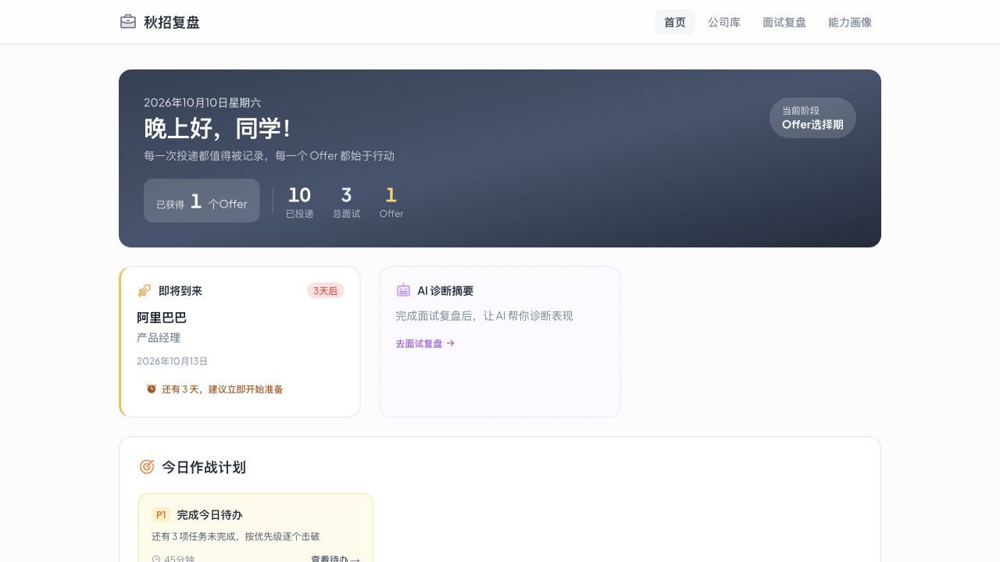
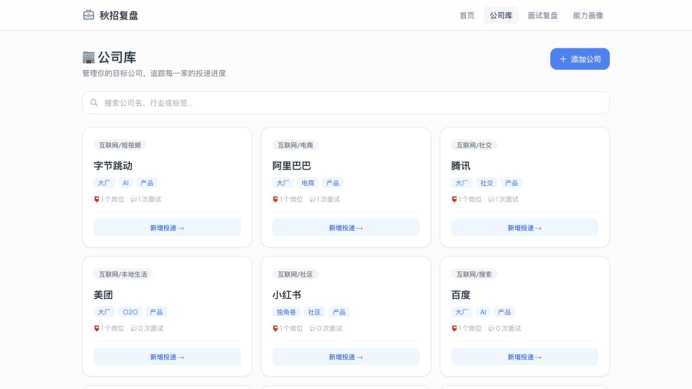
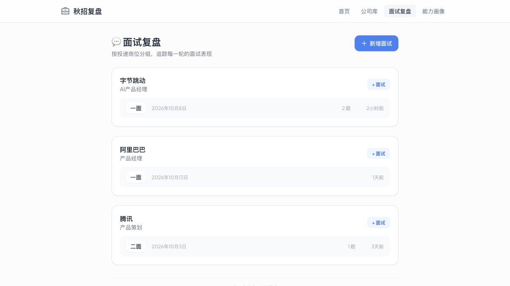
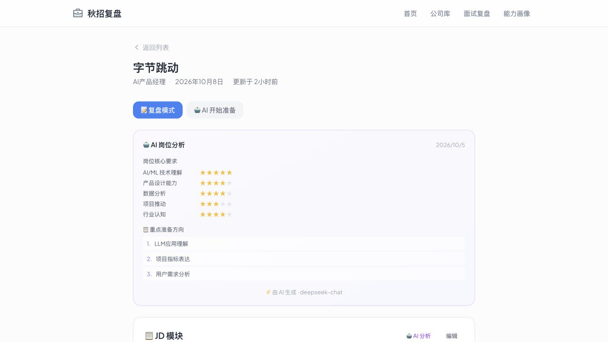
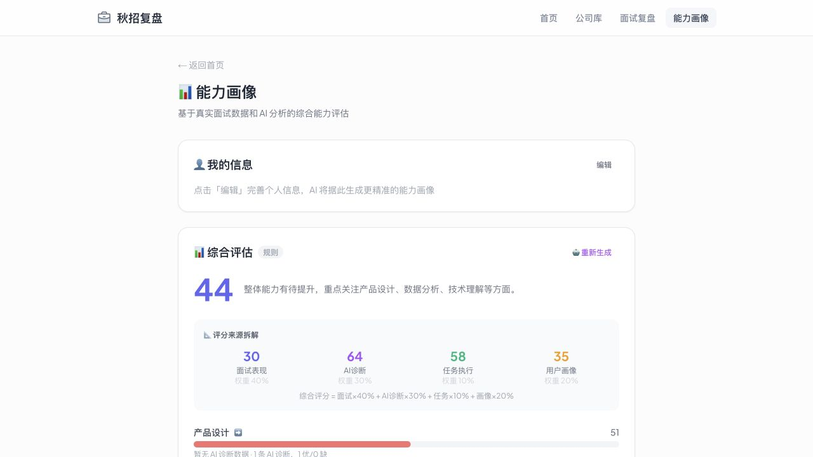
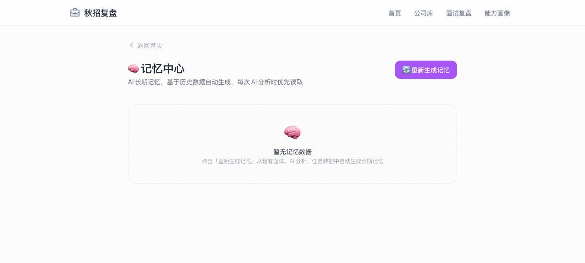
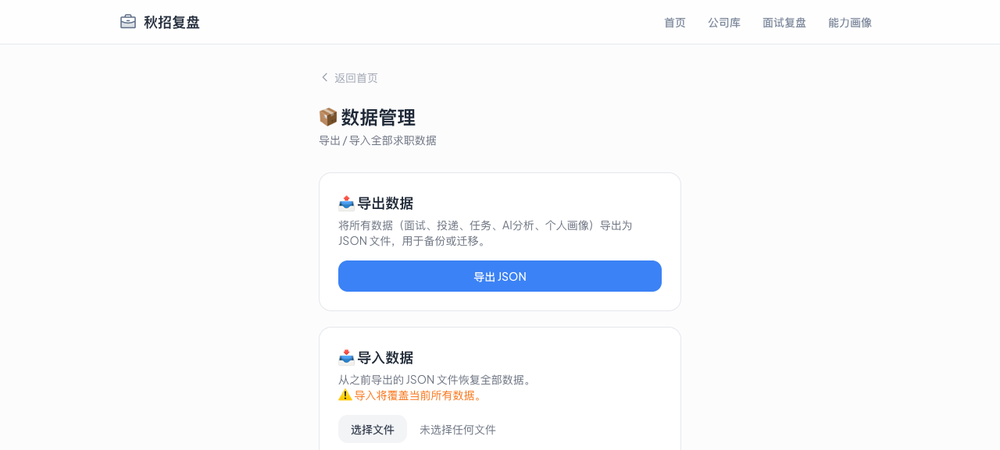

<div align="center">

# 秋招复盘系统

### Qiuzhao Dashboard

**记录每一次投递，把面试复盘变成下一步行动。**

面向校招求职者的个人求职工作台，集投递追踪、面试复盘、日程待办与 AI 辅助分析于一体。

[页面预览](#页面预览) · [核心功能](#核心功能) · [快速开始](#快速开始) · [开发说明](#开发说明) · [改进方向](#改进方向)

</div>



## 项目简介

同时准备多家公司、多个岗位时，投递进度、面试问答和准备任务很容易散落在表格与笔记里。秋招复盘系统将这些信息放到一个工作台中，帮助你回答三个问题：**现在进展如何？上次面试暴露了什么问题？接下来应该准备什么？**

项目以 **公司 → 岗位投递 → 面试轮次** 组织记录。你可以追踪同一家公司的不同岗位，保存每轮面试的 JD、问答与总结，再结合 AI 诊断和历史记录梳理能力短板、安排后续任务。

- **围绕个人求职设计**：从投递到复盘，再到准备任务，持续记录求职过程。
- **基础使用无需数据库**：业务记录默认保存在当前浏览器，支持 JSON 备份与恢复。
- **AI 按需启用**：配置 DeepSeek 密钥后使用模型分析；部分功能另有本地规则或模拟结果作为回退。
- **积累跨面试的经验**：能力画像与长期记忆聚合历史记录，为后续准备提供参考。

当前诊断提示词对产品经理、AI 产品等岗位有较多针对性设计。项目仍在迭代，已实现能力与预留功能见[当前功能边界](#当前功能边界)。

## 页面预览

截图展示示例求职记录。下方覆盖全部 7 类已有页面，首页预览见上方。

### 公司库 · 把目标公司与岗位放在一起

维护公司资料、行业和标签，查看关联投递与面试数量。



### 面试列表 · 追踪同一岗位的不同轮次

按投递分组整理面试，方便回顾每个岗位的面试进程。



### 面试详情 · 保存问答，形成复盘

集中整理岗位 JD、面试问题、个人回答与复盘总结，并使用 AI 辅助诊断。



### 能力画像 · 从多次记录中发现薄弱环节

结合个人资料、面试与任务情况，查看能力维度、趋势和成长建议。



### 长期记忆 · 留下可以继续使用的求职经验

聚合历史优势、待提升项、面试模式与学习目标，为后续分析补充背景。



### 数据管理 · 备份与迁移求职记录

导出 JSON、恢复备份，或清理失去关联的投递与面试记录。



已有 PNG 版本：[仪表盘](docs/images/dashboard.png) · [公司库](docs/images/companies.png) · [面试列表](docs/images/interviews.png) · [能力画像](docs/images/profile.png)。全部截图见 [docs/images](docs/images)。

## 核心功能

| 模块 | 可以做什么 |
| --- | --- |
| 求职仪表盘 | 查看投递与 Offer 指标、下一场面试、诊断摘要、行动建议及待办 |
| 公司与投递 | 管理公司资料和岗位信息，搜索公司，更新投递状态 |
| 面试准备与复盘 | 记录多轮面试、JD、问题与回答，切换准备模式和复盘模式 |
| AI 辅助分析 | 分析 JD、生成面试诊断，查看匹配度、优势、不足与改进建议 |
| 日程与任务 | 使用周视图日历管理独立日程，跟进待办、优先级与完成反馈 |
| 能力画像 | 维护个人资料，结合历史记录生成能力评估与成长建议 |
| 长期记忆 | 聚合历史面试信息，并用于部分后续 AI 分析 |
| 数据管理 | 导入、导出 JSON 备份，清理孤立数据 |

投递状态覆盖：

```text
未投递 → 已投递 → 笔试中 → 已笔试 → 面试中 → 已Offer / 已拒绝
```

### 推荐使用流程

1. **建立目标**：添加公司，为感兴趣的岗位创建投递记录。
2. **安排准备**：新增面试轮次，填写时间与 JD，安排日程和待办。
3. **及时复盘**：记录实际问题、回答和总结，按需生成 AI 诊断。
4. **跟进行动**：结合诊断和能力画像安排任务，记录完成反馈。
5. **定期备份**：导出求职数据，为后续迁移或恢复保留副本。

## 快速开始

### 环境要求

建议使用 **Node.js 20** 与 **npm**，与仓库工作流的 Node.js 版本一致。基础功能无需初始化数据库。

### 本地运行

```bash
git clone https://github.com/zfreeya/qiuzhao-dashboard.git
cd qiuzhao-dashboard
npm ci
npm run dev
```

打开 [http://localhost:3000](http://localhost:3000)。若端口被占用，可使用 `npm run dev -- --port 3001`。

### 启用 AI 分析

复制项目中的环境模板：

```bash
cp .env.example .env.local
```

在 `.env.local` 中填入自己的密钥：

```dotenv
DEEPSEEK_API_KEY=your_deepseek_api_key
```

重启开发服务器后即可尝试 AI 分析。当前服务端调用地址为 `https://api.deepseek.com`，模型为 `deepseek-chat`。

密钥由服务端读取，请勿加上 `NEXT_PUBLIC_` 前缀或提交到仓库。调用模型时，相关 JD、问答、个人资料或历史摘要会按功能需要发送给 DeepSeek。

### 常用命令

| 命令 | 用途 |
| --- | --- |
| `npm run dev` | 启动开发服务器 |
| `npm run lint` | 执行代码规范检查 |
| `npm run build` | 生成生产构建 |
| `npm run start` | 启动生产服务，需先完成构建 |

## 数据与 AI 说明

### 数据保存在哪里？

公司、投递、面试、任务、分析结果、个人资料和长期记忆默认保存于 **浏览器 localStorage**。当前没有账户系统或自动跨设备同步，数据按浏览器和站点来源隔离；清除站点数据会影响已保存记录。

可在“数据管理”页面导出 JSON 备份。导入会覆盖文件中对应的数据集合，操作前建议先备份，导入后刷新页面查看结果。**独立日程暂未纳入导入、导出范围。**

### 当前功能边界

| 功能 | 实现情况 |
| --- | --- |
| 面试诊断 | 已接入 DeepSeek，接口或模型调用失败时显示错误 |
| JD 分析 | 优先调用模型；失败时返回基于岗位关键词的模拟结果 |
| 能力画像 | 优先调用模型；失败时回退到本地规则计算 |
| 成长建议、能力证据、任务反馈分析 | 已有接口和调用代码，部分接口包含降级处理 |
| 长期记忆 | 由本地服务聚合历史记录，供部分 AI 请求使用 |
| 首页建议与准备内容 | 部分由规则或模板生成，并非全部来自实时模型分析 |
| 录音 | 可手动添加录音记录；文件上传、转写与内容提取尚未实现 |
| 模拟面试 | 已有入口，实时对话与语音模拟尚未实现 |
| Prisma / SQLite | 已预留模型和仓储代码，尚未启用，部分方法仍为占位实现 |

模型评分和规则结果用于辅助复盘，建议结合实际面试反馈判断。未配置密钥时，仍可使用基础记录管理功能；模拟结果不代表模型已成功分析你的完整材料。

## 技术栈

| 层面 | 技术 |
| --- | --- |
| 框架 | Next.js 14.2.35 · App Router |
| 界面与状态 | React 18 · React Context · Hooks |
| 语言 | TypeScript 5 · 严格模式 |
| 样式与图标 | Tailwind CSS 3.4 · PostCSS · Phosphor Icons |
| 字体 | Plus Jakarta Sans，通过 `next/font/google` 加载 |
| AI | OpenAI SDK 6.x · DeepSeek 兼容接口 |
| 持久化 | localStorage · 带版本号的数据封装 |
| 扩展预留 | Repository 接口 · Prisma 7 · SQLite |
| 代码检查 | ESLint 8 · eslint-config-next |

## 开发说明

### 项目结构

```text
qiuzhao-dashboard/
├── src/
│   ├── app/                    # 页面、布局与 AI API 路由
│   │   ├── companies/          # 公司库与公司详情
│   │   ├── applications/       # 投递新增与编辑
│   │   ├── interviews/         # 面试列表、新增与复盘
│   │   ├── profile/            # 能力画像
│   │   ├── memory/             # 长期记忆
│   │   ├── data/               # 数据管理
│   │   └── api/                # AI 分析接口
│   ├── _shared/                # 实体类型、全局状态与存储封装
│   ├── components/             # AI 诊断、日历与日程组件
│   ├── services/               # 业务逻辑与数据访问
│   │   └── repositories/       # 仓储接口、本地与 Prisma 实现
│   ├── prompts/                # 各类 AI 提示词
│   ├── server/                 # 面试诊断模型调用与输出校验
│   └── lib/                    # Prisma 客户端预留代码
├── docs/images/                # 页面截图
├── design-system/              # 设计规范
├── prisma/schema.prisma        # 预留数据库模型
├── .env.example                # 环境变量模板
├── next.config.mjs             # Next.js 运行配置
└── package.json
```

### 业务与存储分层

核心数据按 `Company → Application → Interview` 关联。页面主要通过全局 Context 访问业务操作，再经数据服务与 Repository 完成持久化：

```text
页面 / 组件 → InterviewContext → dataService → localRepository → localStorage
```

日程由独立的 `scheduleService` 管理。AI 请求通过 Next.js 服务端接口访问 DeepSeek，结果再由客户端保存。实体类型、业务逻辑、提示词和仓储实现分开组织，便于继续扩展。

### 页面路由

| 页面 | 路由 |
| --- | --- |
| 仪表盘 | `/` |
| 公司库 / 公司详情 | `/companies` · `/companies/[id]` |
| 新增 / 编辑投递 | `/applications/new` · `/applications/[id]/edit` |
| 面试列表 / 新增 / 详情 | `/interviews` · `/interviews/new` · `/interviews/[id]` |
| 能力画像 / 长期记忆 / 数据管理 | `/profile` · `/memory` · `/data` |

## 部署

当前项目使用 **Next.js 服务端运行配置**，生产运行方式为：

```bash
npm ci
npm run build
npm run start
```

也可部署到支持 Next.js 服务端的托管环境，并在平台环境变量中配置 `DEEPSEEK_API_KEY`。构建阶段需要能够访问 Google Fonts，以下载项目使用的字体。

仓库保留的 GitHub Pages 工作流目前仅支持手动触发，仍期待 `out/` 静态产物，**与当前服务端配置不兼容**。GitHub Pages 也无法运行本项目的服务端 AI 接口；若需要静态版，应另行处理 API 与动态详情路由。

## 改进方向

以下为基于当前实现整理的后续改进建议，不包含发布承诺：

- [ ] 将独立日程纳入备份恢复，增强导入校验与数据版本迁移。
- [ ] 在界面中明确标识模型、模拟与规则结果的来源。
- [ ] 完善录音上传、转写及面试内容提取。
- [ ] 实现可交互的模拟面试与反馈。
- [ ] 完善数据库仓储，探索跨设备数据同步。
- [ ] 补充状态流转、级联删除、备份恢复与 AI 降级等关键流程测试。
- [ ] 整理独立的静态展示方案，验证动态详情页的访问与刷新行为。

## 反馈与贡献

欢迎通过 [Issues](https://github.com/zfreeya/qiuzhao-dashboard/issues) 反馈问题或提出建议。报告问题时，请说明复现步骤、预期结果、实际表现及浏览器环境；涉及 AI 功能时，可附上去除密钥和个人信息后的错误提示。

提交改动前请运行 `npm run lint`，涉及运行配置或应用代码时验证 `npm run build`。环境密钥、依赖目录、构建产物和个人求职数据不应随代码提交。
